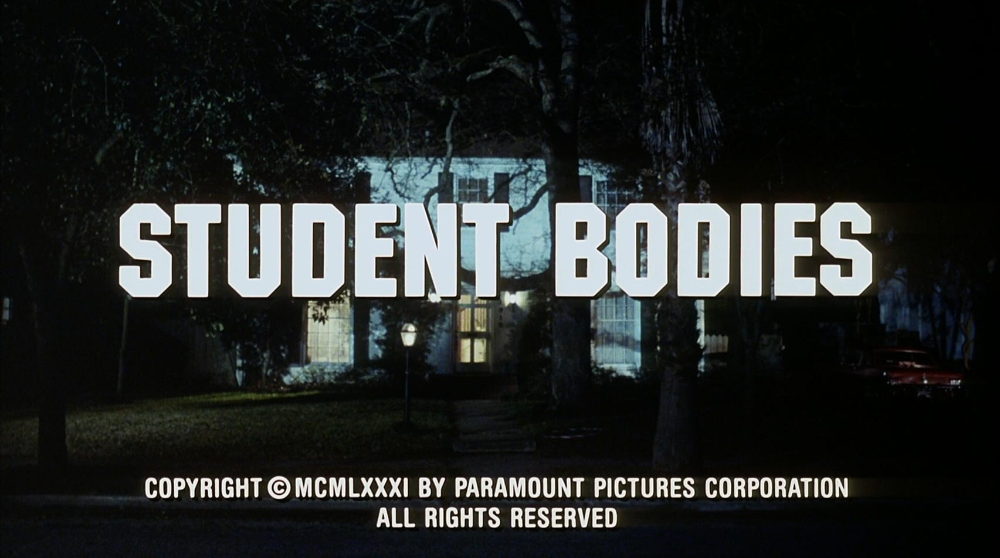

<h1 align="center">
  Face-Recognition of famous Personalities
</h1>

## Authors
<h4 align="center">
  Kapil Yadav1, Vivek Sapkal1, Heramb Gavankar1, Raj Patel2, Arsewad Bhagwan 1, Suhani1, Jatin1
</h4>

## Links
<h4 align="center">
  [Code](#) | [Dataset](#) | [Poster](#) | [Slides](#) | [Short Talk](#)
</h4>

## Abstract
Non-native speakers with limited vocabulary often struggle to name specific objects despite being able to visualize them clearly, e.g., people outside Australia searching for ‘numbats.’ Further, users may want to search for such elusive objects with difficult-to-sketch interactions, e.g., “numbat digging in the ground.” In such common but complex situations, users desire a search interface that accepts composite multimodal queries comprising hand-drawn sketches of “difficult-to-name but easy-to-draw” objects along with text describing “difficult-to-sketch but easy-to-verbalize” object’s attributes or interaction with the scene. This novel problem statement is distinctly different from the previously well-researched TBIR (text-based image retrieval) and SBIR (sketch-based image retrieval) problems. To study this under-explored task, we curate a dataset, CSTBIR (Composite Sketch+Text Based Image Retrieval), consisting of ∼2M queries and 108K natural scene images. Further, as a solution to this problem, we propose a pretrained multimodal transformer-based baseline, STNET (Sketch+Text Network), that uses a hand-drawn sketch to localize relevant objects in the natural scene image, and encodes the text and image to perform image retrieval. In addition to contrastive learning, we propose multiple train- ing objectives that improve the performance of our model. Extensive experiments show that our proposed method outperforms several state-of-the-art retrieval methods for text-only, sketch-only, as well as composite query modalities

## Classification Problem

  

Composite Sketch+Text Based Image Retrieval: A user wants to search “Numbat digging in the ground” but does not know the word “numbat”, and the interaction “digging in the ground” is not easy to sketch. Thus, the user may use a hand-drawn sketch of "numbat" along with the text "digging in the ground" to retrieve the desired images.

## Short Talk

  <iframe width="560" height="315" src="[https://www.youtube.com/embed/YOUR_VIDEO_ID](https://youtu.be/s4F7qeVw5mY)" frameborder="0" allowfullscreen></iframe>

## BibTex
@InProceedings{cstbir2024aaai,
        author    = {Gatti, Prajwal and Parikh, Kshitij Gopal and Paul, Dhriti Prasanna and Gupta, Manish and Mishra, Anand},
        title     = {Composite Sketch+Text Queries for Retrieving Objects with Elusive Names and Complex Interactions},
        booktitle = {AAAI},
        year      = {2024},
}   

## Contributors
|  |  |  |  |  |  |  |

|---------------------------------------------|----------------------------------------------------------|---------------------------------------------------------|-------------------------------------------|------------------------------------------|
| [Kapil Yadav](#)                           | [Vivek Sapkal](#)                                 | [Heramb Gavankar](#)
                                 | [Arsewad Bhagwan](#)                                 | [Raj Patel](#)                         | [Suhani](#)                        | [Jatin](#)                        |
|  |  |  |  |  |  |  |
|  |  |  |  |  |  |  |

## Acknowledgment
This work is supported by the Startup Research Grant from the Science and Engineering Research Board (SERB), Department of Science and Technology, Government of India (Grant No: SRG/2021/001948).

## Contact
For questions, please contact Prajwal Gatti or raise an issue on GitHub.

  Copyright © IIT Jodhpur

