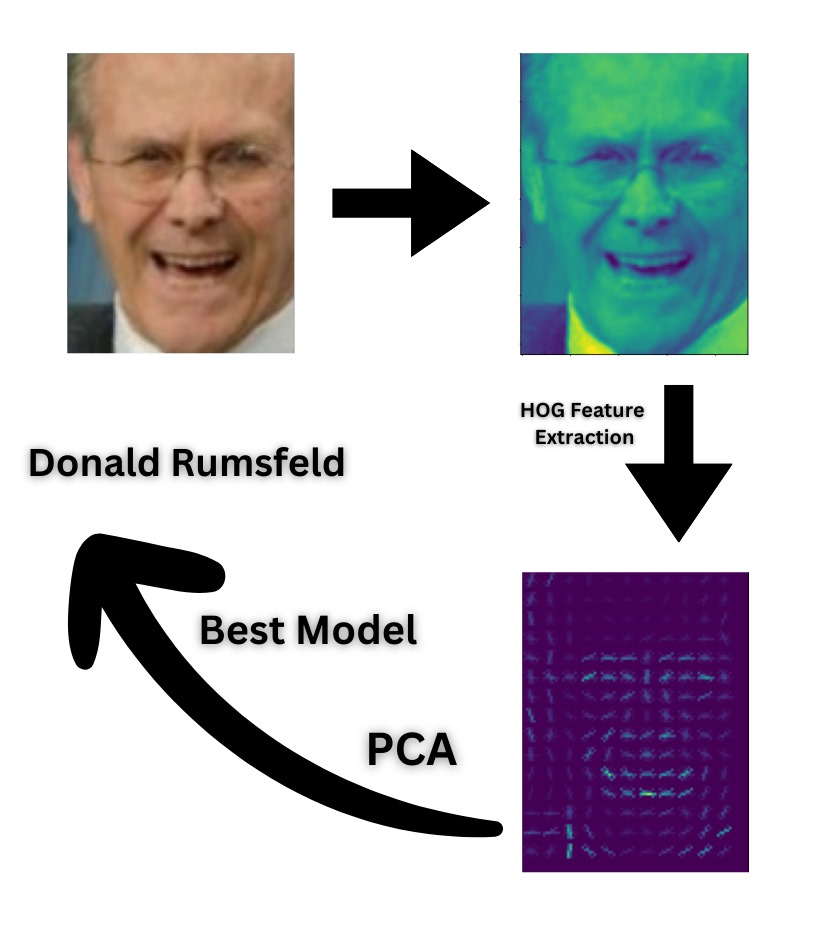
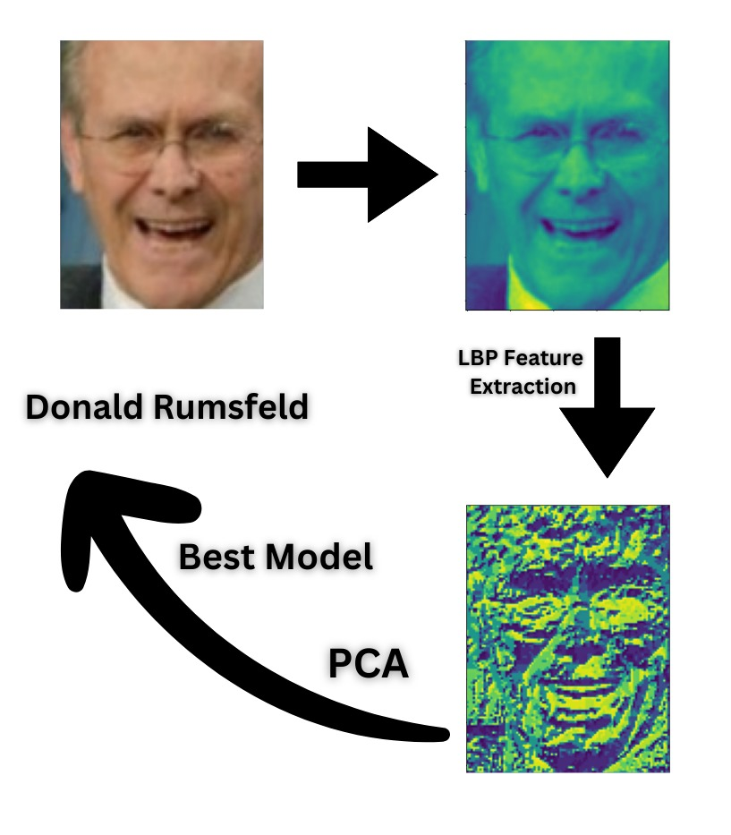
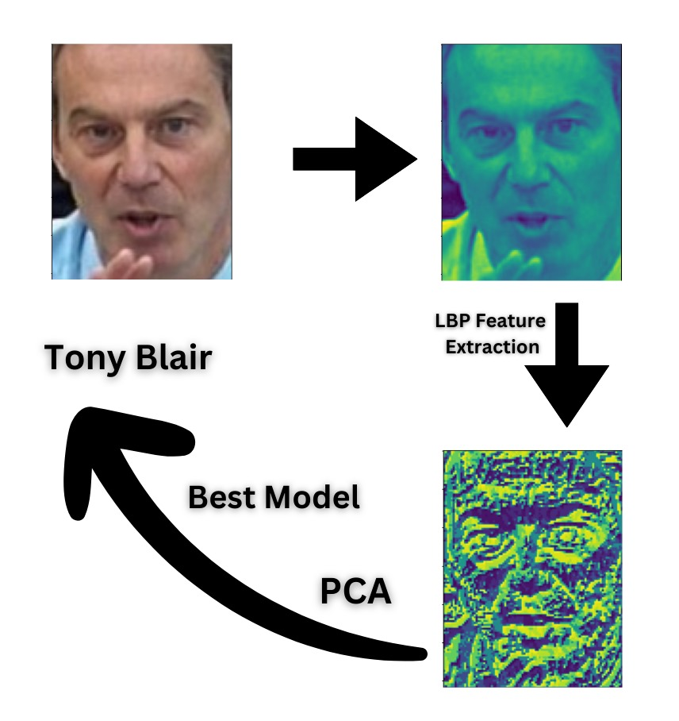
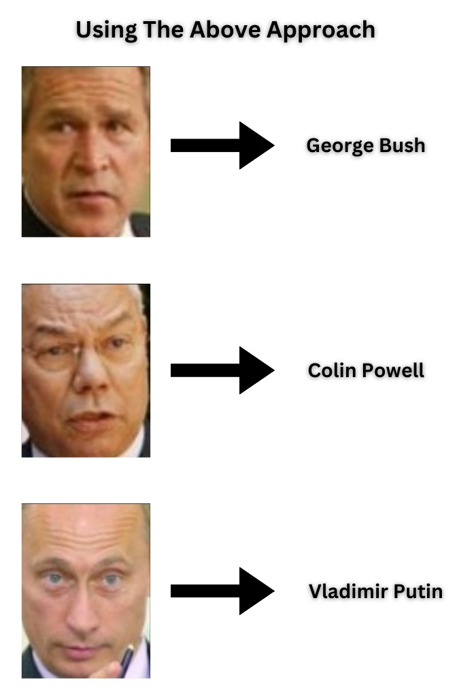

<link rel="stylesheet" href="style.css">

<h1 align="center">
  Face-Recognition of Famous Personalities
</h1>

<h4 align="center">
  Kapil Yadav, Vivek Sapkal, Heramb Gavankar, Raj Patel, Arsewad Bhagwan, Suhani, Jatin
</h4>

<h4 align="center">
  <a href="#">Code</a> | <a href="#">Dataset</a> | <a href="#">Demo Code</a> | <a href="#">Slides</a> | <a href="https://www.youtube.com/embed/s4F7qeVw5mY">Short Talk</a>
</h4>

  

    
  

  

    
  

  

    
  

  

    
  

  <!-- Add more images as needed -->

<!-- Dots/bullets -->

  
  
  
  
  <!-- Add more dots as needed -->

## Abstract
Our primary goal is to scrutinize the performance metrics of various face recognition algorithms when applied to the LFW dataset. This exploration aims to offer comprehensive insights into the algorithms' efficacies and inherent limitations.
To achieve our objectives, we employ a spectrum of methodologies, encompassing traditional machine learning techniques. We conduct systematic experiments to evaluate the impact of variables like pose variations, lighting conditions, and facial expressions on recognition accuracy.This project not only enhances our grasp of foundational concepts in face recognition but also furnishes us with hands-on experience in deploying and assessing traditional machine learning algorithms. The knowledge gleaned from this venture is poised to enrich our academic journey and equip us for subsequent research or professional engagements in computer vision and machine learning domains.

## Classification Problem

  

Composite Sketch+Text Based Image Retrieval: A user wants to search “Numbat digging in the ground” but does not know the word “numbat”, and the interaction “digging in the ground” is not easy to sketch. Thus, the user may use a hand-drawn sketch of "numbat" along with the text "digging in the ground" to retrieve the desired images.

## Short Talk

  <iframe width="560" height="315" src="https://www.youtube.com/embed/s4F7qeVw5mY" frameborder="0" allowfullscreen></iframe>

## BibTex

  <pre>
  @InProceedings{cstbir2024aaai,
        author    = {Sapkal, Vivek and Yadav, Kapil and Arsewad, Bagwan and Gavankar, Heramb and Patel, Raj and Suhani and Jateen},
        title     = {Face Recognition on Labelled Faces in the Wild (Dataset)},
        year      = {2024},
    }      
  </pre>

## Contributors

  

    
    
Kapil Yadav

    

      
      
    

  

  

    
    
Vivek Sapkal

    

      
      
    

  

  

    
    
Heramb Gavankar

    

      
      
    

  

  

    
    
Raj Patel

    

      
      
    

  

  

    
    
Arsewad Bhagwan

    

      
      
    

  

  

    
    
Suhani

    

      
      
    

  

  

    
    
Jatin

    

      
      
    

  

## Acknowledgment
This work is supported by the Startup Research Grant from the Science and Engineering Research Board (SERB), Department of Science and Technology, Government of India (Grant No: SRG/2021/001948).

## Contact
For questions, please contact Prajwal Gatti or raise an issue on GitHub.

  Copyright © IIT Jodhpur

