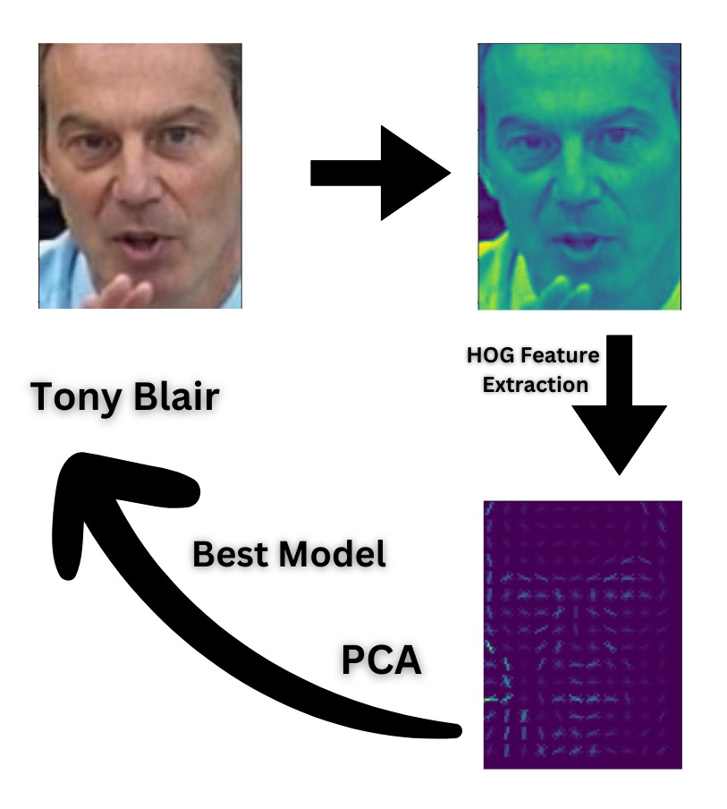

<link rel="stylesheet" href="style.css">

<h1 align="center">
  Face-Recognition of Famous Personalities
</h1>

<h4 align="center">
  Kapil Yadav, Vivek Sapkal, Heramb Gavankar, Raj Patel, Arsewad Bhagwan, Suhani, Jateen
</h4>

<h4 align="center">
  <a href="https://github.com/ykapil897/face-recognition">Code</a> | <a href="https://www.kaggle.com/datasets/jessicali9530/lfw-dataset">Dataset</a> | <a href="demo_code/prediction.html">Demo Code</a> | <a href="https://github.com/ykapil897/face-recognition/blob/main/Report/Report.pdf" target="_blank">Report</a> | <a href="https://youtu.be/QA3rB10ZQGw?si=kTNf-rmSl9RWmkSw">Short Talk</a>
</h4>

  

    
  

  

    
  

  

    
  

  

    
  

<!-- Dots/bullets -->

  
  
  
  
  <!-- Add more dots as needed -->

## Abstract
Our primary goal is to scrutinize the performance metrics of various face recognition algorithms when applied to the LFW dataset. This exploration aims to offer comprehensive insights into the algorithms' efficacies and inherent limitations.
To achieve our objectives, we employ a spectrum of methodologies, encompassing traditional machine learning techniques. We conduct systematic experiments to evaluate the impact of variables like pose variations, lighting conditions, and facial expressions on recognition accuracy.This project not only enhances our grasp of foundational concepts in face recognition but also furnishes us with hands-on experience in deploying and assessing traditional machine learning algorithms. The knowledge gleaned from this venture is poised to enrich our academic journey and equip us for subsequent research or professional engagements in computer vision and machine learning domains.

## Classification Problem

  

Imagine a user who possesses an image of an individual and aims to identify the person depicted. Despite having the image, the user lacks the name associated with it. In such a situation, the user can leverage a trained model capable of recognizing famous personalities by analyzing their facial features.

## Short Talk

  <iframe width="560" height="315" src="https://youtu.be/QA3rB10ZQGw" frameborder="0" allowfullscreen></iframe>

## BibTex

    <pre>
@online{AnalyticaVidhya,
    author = "Aishwarya Singh",
    title = "Feature Engineering for Images: A Valuable Introduction to the HOG Feature Descriptor",
    url  = "https://www.analyticsvidhya.com/blog/2019/09/feature-engineering-images-introduction-hog-feature-descriptor/",
    addendum = "(accessed: 07.04.2024)",
    keywords = "latex,Hog,features"
}

@online{Medium_aricle,
    author = "Mahmoud Harmouch",
    title = "Local Binary Pattern Algorithm: The Math Behind It",
    url  = "https://medium.com/swlh/local-binary-pattern-algorithm-the-math-behind-it-%EF%B8%8F-edf7b0e1c8b3",
    addendum = "(accessed: 04.04.2024)",
    keywords = "latex,LocalBinaryPattern,featureExtraction"
}

@online{Neural_network,
    author = "Michael Nielsen",
    title = "How the backpropagation algorithm works",
    url  = "http://neuralnetworksanddeeplearning.com/chap2.html",
    addendum = "(accessed: 28.03.2024)",
    keywords = "latex,neuralnetworks,backpropagation"
}

@online{CNNResnet,
    author = "Jeff Prosise",
    title = "Facial Recognition with CNNs",
    url  = "https://www.atmosera.com/blog/facial-recognition-with-cnns/",
    addendum = "(accessed: 14.04.2024)",
    keywords = "latex,CNN,Resnet"
}
    </pre>

## Acknowledgment
We would like to express my sincere gratitude to Anand Mishra, Assitant Professor, for this course project .

## Contact
For questions, please contact any of the coordinators or raise an issue on <a href="https://github.com/ykapil897/face-recognition"> Github </a>.

